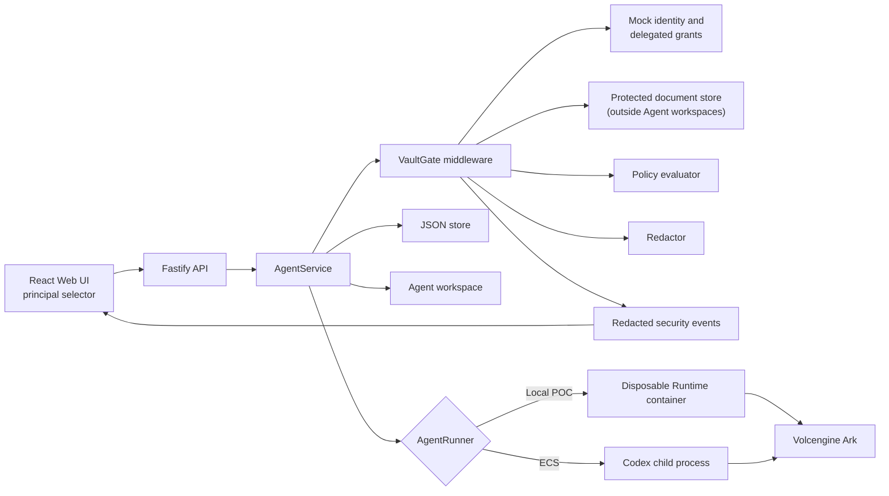

# Architecture

Volc Agent Launchpad is a single-node control plane for hackathon use,
extended here with VaultGate — policy-enforced document access middleware —
implementing the Bouncer track.



## Trust boundary

VaultGate sits fully inside the backend, between `AgentService` and
`AgentRunner`. The UI's principal selector is a controlled demo identity,
not authentication — every decision that matters is re-checked server-side
regardless of what the UI sends. A denied document contributes zero
characters to the Runtime prompt; a redacted field is stripped before the
prompt is built, not after. Approved, redacted excerpts are still processed
by the real Ark model — VaultGate does not claim confidentiality during
inference, only that denied or restricted content never reaches that
boundary. Missing identity, a missing grant, or an internal middleware
error all fail closed (deny), never open.

## Components

### Web UI

Lists Agents, manages lifecycle actions, submits prompts, polls asynchronous
Runs, and lets the demo operator select which mock principal (Alice or Bob)
is acting. It never receives the Ark API key.

### Fastify API

Validates requests, protects remote demos with a shared bearer token, and
serves the compiled Web UI. The token is not user identity or authorization;
`X-Demo-Principal` (checked against a fixed list) is what VaultGate uses
for that.

### AgentService

Coordinates lifecycle state, persistence, workspaces, and Runs. Calls
VaultGate's `prepareContext` before every message reaches `AgentRunner`. One
Agent can have only one active Run.

```text
ready -> busy -> ready
  |       |
  v       v
stopped  error
```

Interrupted Runs become `cancelled` after a restart.

### Storage

```text
data/launchpad.json       Agent, message, Run, security event, and revoked-grant metadata
workspaces/AgentID/       Agent-created files
workspaces/.deleted/      Archived deleted workspaces
codex-home/               Codex configuration and sessions
```

Protected documents live in `apps/server/src/security/fixtures.ts`, a
server-only module — never under `workspaces/`, so an Agent's own file
access can never reach them directly.

`JsonStore` serializes writes and atomically replaces one JSON file. It supports
one process only.

### Runtime providers

- `CodexRunner` runs Codex inside the application container for ECS.
- `ContainerCodexRunner` starts one disposable Docker, Colima, or Podman
  container for every local turn.

Both providers use argv-only process execution, bound output and time, resume
the stored Codex thread, and escalate termination after a grace period.

## Deployment profiles

| Profile | Control plane | Agent execution |
| --- | --- | --- |
| Local POC | Host Node.js | Disposable local container |
| ECS | Application container | Codex process in the same container |
| Local development | Host Node.js | Host Codex process |

## Extension seams

| Track | Primary seam | Status |
| --- | --- | --- |
| Bouncer | `AgentService`, `apps/server/src/security/` | **Implemented as VaultGate.** Document-level policy, redaction, and correlated audit events added at the `AgentService` boundary — see [../README.md#vaultgate-bouncer-track](../README.md#vaultgate-bouncer-track). |
| Glass Box | `AgentRunner`, `AgentRun` | Not selected. Would emit and display correlated execution events. |
| Kill Switch | `AgentRunner` | Not selected. Would add threat-specific policy or a stronger sandbox. |

The current container or ECS instance is the POC trust boundary. Ordinary
containers are not hardened multi-tenant isolation. VaultGate's own trust
boundary is documented above, separately from this Runtime boundary — the
two are independent: VaultGate controls what enters a prompt; the container
boundary controls what an Agent's tool calls can reach.

## Known limitations

- Identity is a fixed demo principal list (`X-Demo-Principal`), not a real
  identity provider — by design, out of scope for a hackathon POC (see the
  plan's Non-Goals).
- Protected documents are eight synthetic fixtures with local keyword
  retrieval, not a production document store or a hosted vector index.
- `JsonStore` supports one process only; revocation and grant state are not
  concurrency-safe across multiple server instances.
- Approved, redacted content is still sent to the real Ark model for
  inference — VaultGate's guarantee is about what enters the prompt, not
  about confidentiality during inference itself.
