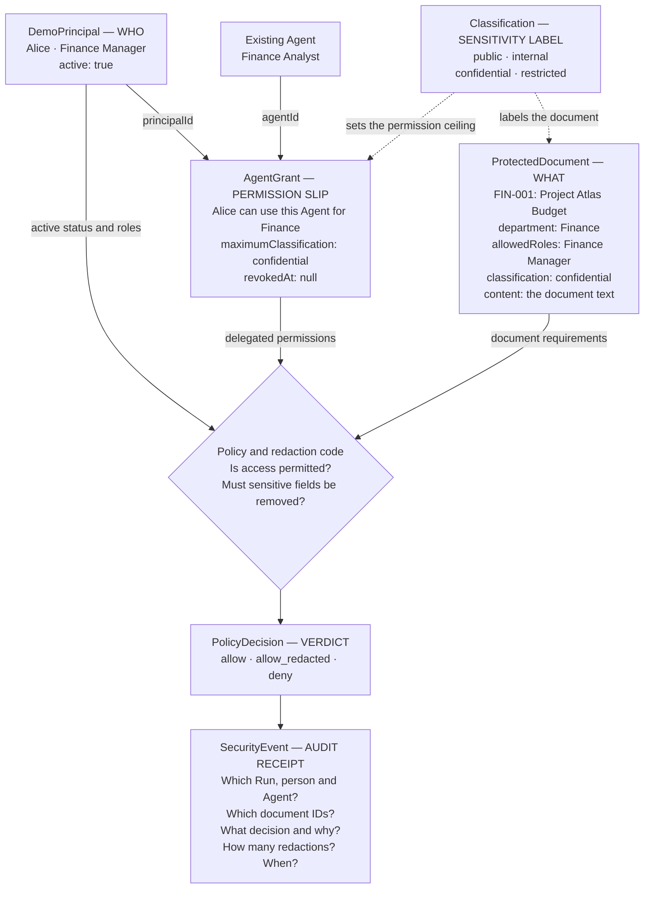
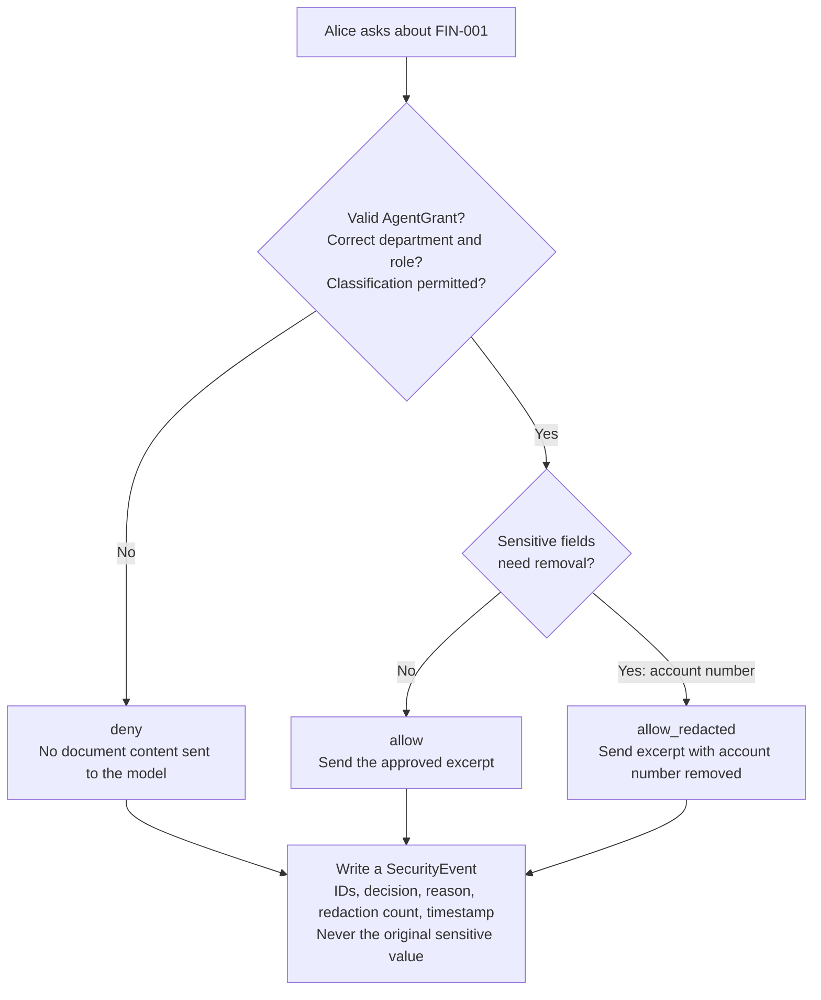

Four are records: DemoPrincipal, AgentGrant, ProtectedDocument, SecurityEvent. The other two are allowed sets of labels, not separate objects.

A concrete example
Alice asks: “Summarize the Project Atlas budget.”

